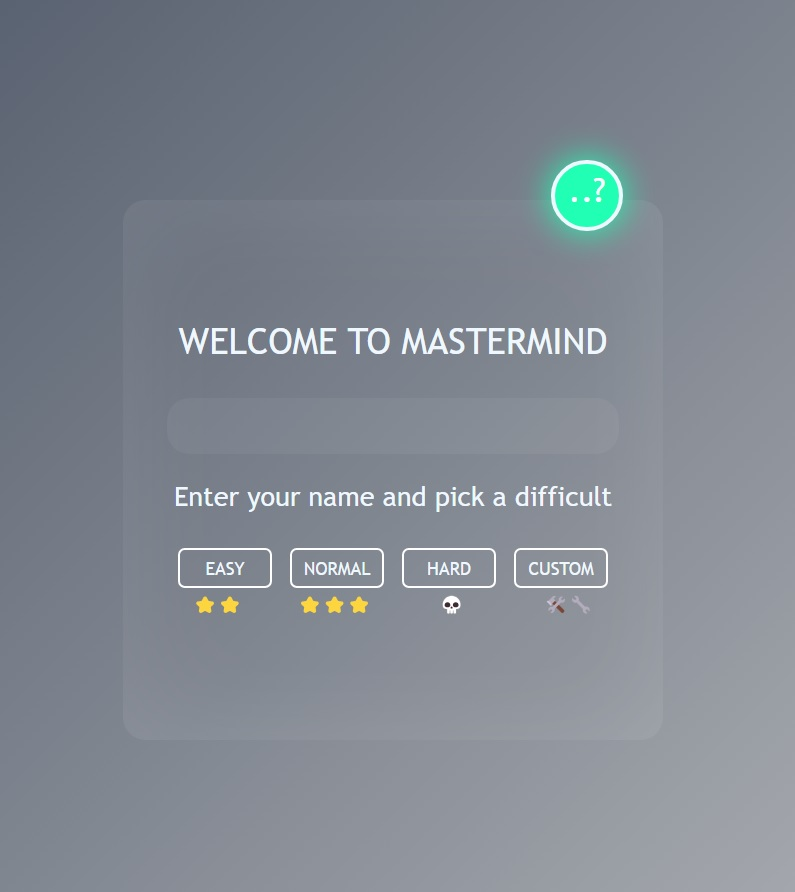
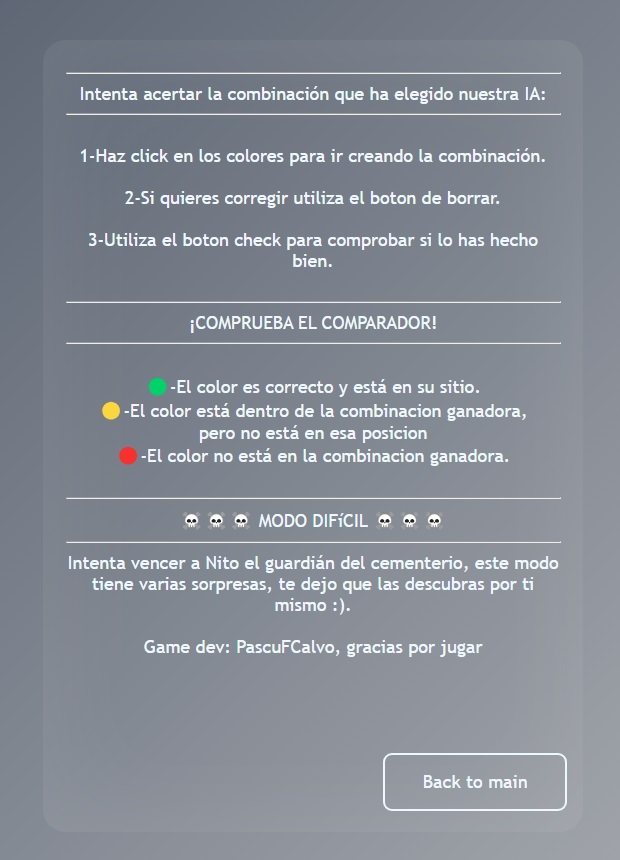
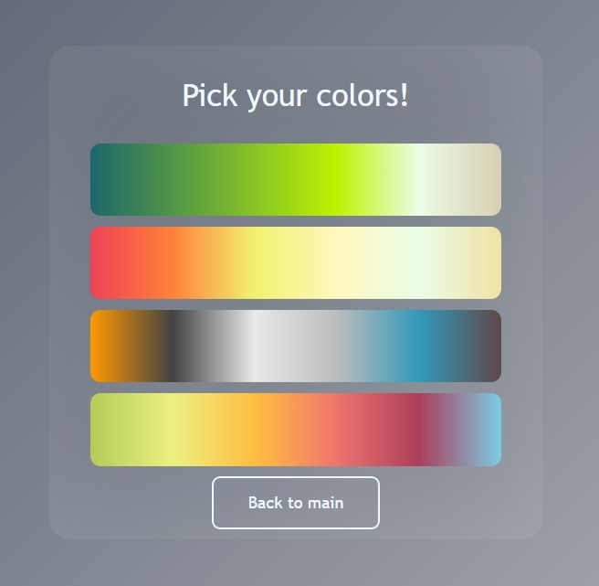
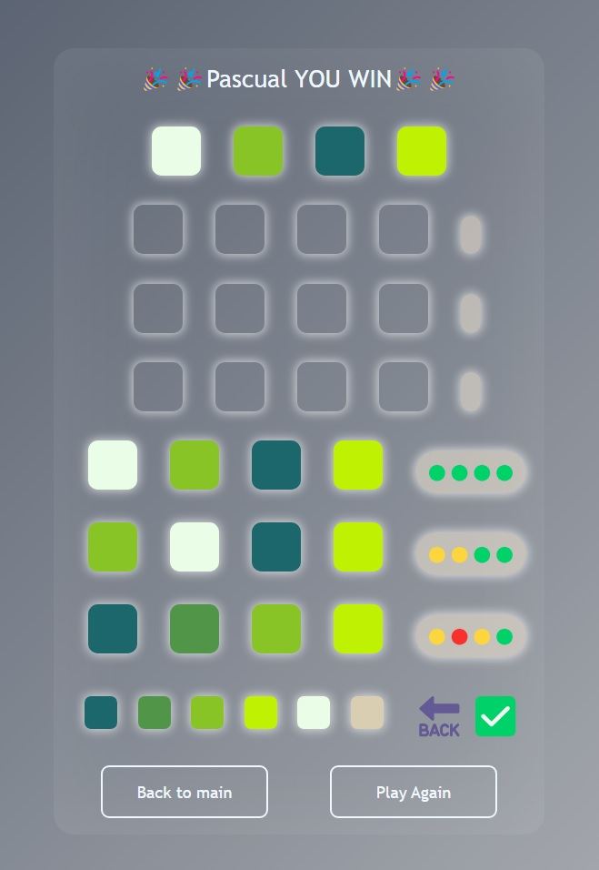
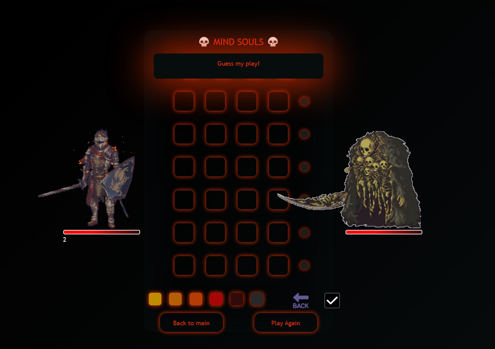
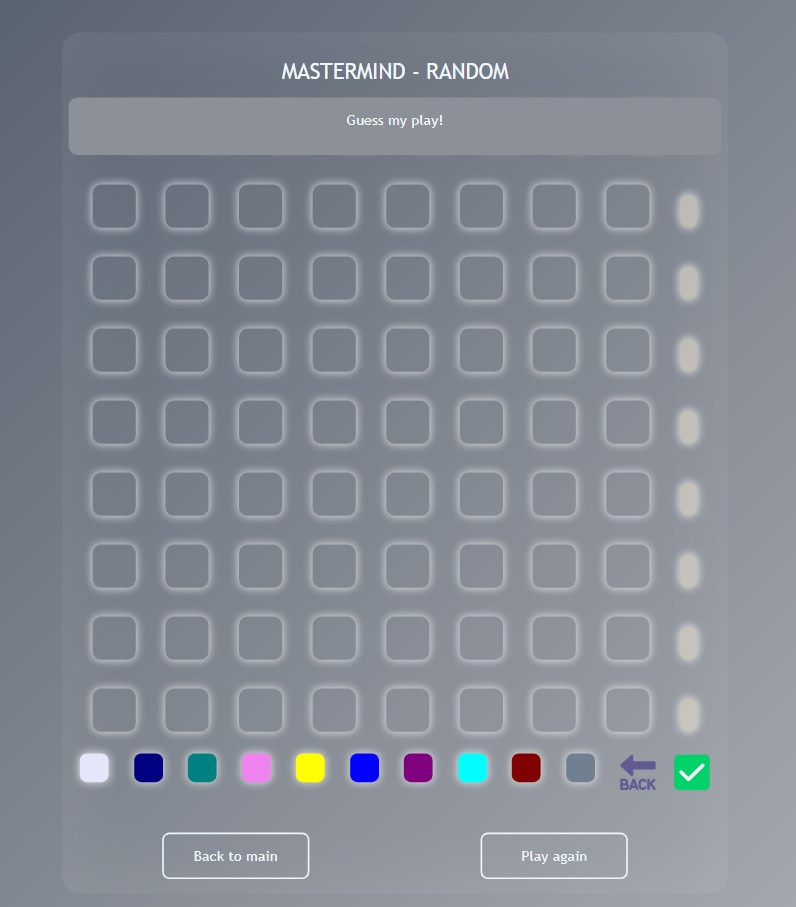

<h1 align="center"> MASTERMIND GAME</h1>
​
​

Proyecto 3 - Mastermind Game- Semana 3-4

​

Proyecto de creacion del juego MasterMind por Pascual Fernandez.
 
Desarrollada como formacion del Bootcamp de Full Stack Developer de Geekshubs Academy.

​
​

​
​
<h5 align="center"> Tecnologías utilizadas</h1>
​

JavaScript, HTML5, CSS3, Bootstrap, GIT y GitHUB

  <tr >
    <td valign="top"></td>
    <td valign="top"></td>
    <td valign="top"></td>
    <td></td>
     <td valign="top"></td>
      <td valign="top"></td>
  

​
<a href = "https://github.com/PascuFCalvo/FSDVlcWeek1">Haz Click para acceder al repositorio</a>

                   
​
## Tabla de contenidos
​

- [👩🏻‍💻 Descripción del proyecto]
- [🔍 Observaciones]
- [⚖️ Licencia y Copyright]
- [📚Instrucciones]
​
​
### Descripción
​
Tercer proyecto creado durante la semana 3 y 4 del bootcamp, centrado sobretodo en aprender el manejo del DOM/BOM, generacion dinamica de elementos y mejora de la esctructura de codigo y carpetas.

##Aqui las diferentes vistas del juego:

######Menu principal:
Puedes consultar el tutorial, introducir tu nombre de jugador y elegir la dificultad.

######Tutorial:
Si no sabes jugar al Mastermind consulta el tutorial.

######Seleccion de colores:
Aqui puedes personalizar la partida.

######El tablero de juego:
Selecciona la combinacion de colores e intenta adivinar la combinacion oculta:

​

######Dark souls mode:
Si el reto normal es poco, prueba este modo

​

######Custom mode:
Genera el tablero y las combinaciones de color a tu gusto para ajustar a la dificultad que mas te guste.

​

###Observaciones
​
- ��Todo el codigo ha sido crado en em's
- ��Hay que refactorizar parte del codigo para no repetir algunas funciones

 
 

### Instrucciones

 
 

### Cambios pendientes
- ��Me gustaria hacer el tablero dinamico mediante drag & drop

### Agradecimientos

A toda esos heroes anonimos que suben trocitos de codigo a internet y hace la vida mucho mas facil a los estudintes.
​
​
### Licencia y copyright
📝 La licencia utilizada es una MIT License.
Este proyecto ha sido realizado pixel a pixel por mi, Pascual Fernandez, para completar la segunda semana del BootCamp Full Stack de GeeksHubs Academy Valencia.